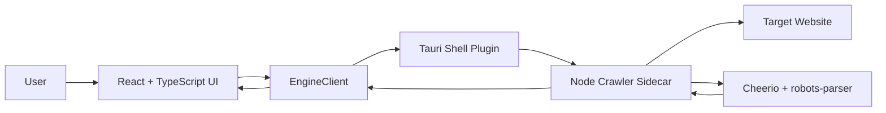

# Scout SEO Crawler

Scout SEO Crawler is a lightweight desktop technical SEO crawler. The current build uses a Tauri desktop shell, a React/TypeScript interface, and a Node.js crawler engine packaged as a Tauri sidecar.

The crawler and SEO analysis logic are intentionally Node-only. Tauri still requires a small Rust bootstrap because Tauri apps compile a native desktop shell, but Rust is not used for crawling, parsing, analysis, or reporting.

## Current Status

This repository currently contains a working MVP scaffold with:

- Tauri desktop app shell.
- React dashboard UI.
- Node sidecar crawler engine.
- Sidecar packaging script.
- Basic crawl controls.
- Live crawl metrics.
- Metadata extraction.
- robots.txt support.
- CSV export.
- macOS app and DMG build support.

Phase 1 data-model foundation is now in place. The Node sidecar keeps structured in-memory stores for pages, links, headings, metadata, indexability, images, sitemaps, and PageSpeed results. Some later report types are still placeholders, but the architecture now has the right data buckets for the next phases.

Phase 2 metadata and indexability validation has started. The crawler now adds issue flags for canonical problems, duplicate metadata across all affected pages, non-sequential heading hierarchy, missing/duplicate Open Graph tags, and robots/canonical indexability reasons.

The UI now includes report tabs for Overview, Metadata, Indexability, Headings, Open Graph, Structured Data, Links, Images, Sitemaps, and PageSpeed. Sitemaps and PageSpeed now populate from crawl/runtime data; advanced breakdowns and exports are still planned.

Phase 3 link and referrer analysis has started. Internal links are enriched after crawl completion with destination status, final URL, destination indexability, broken-link flags, non-indexable destination flags, anchor-text issues, and nofollow-internal-link flags.

Image SEO checks have started. Image extraction now considers `src`, common lazy-load source attributes, and `srcset`; records width, height, lazy-loading state, and flags missing/empty/generic/keyword-stuffed alt text plus missing dimensions.

Sitemap support has started. The crawler discovers sitemap URLs from `robots.txt` and `/sitemap.xml`, parses sitemap indexes and URL sets, and enriches sitemap rows after crawl completion with coverage, status, indexability, and sitemap-specific issues.

PageSpeed Insights support has started. PageSpeed checks are optional and run after crawl completion for a limited number of indexable 2xx URLs. The UI supports an optional API key, max URL limit, and mobile/desktop strategy toggles. The report captures performance score, FCP, Speed Index, LCP, TBT, CLS, INP, and visible API error details when Google rejects a request.

URL-list crawling is now available. Users can switch the crawl mode to only uploaded URLs, upload a `.txt` or `.csv` file containing absolute URLs, and the crawler will fetch only those listed pages while still extracting metadata, links, images, indexability, and report data from them.

Crawl comparison has started. Users can upload a previous Scout CSV export, compare it against the current crawl, and review new URLs, removed URLs, changed status codes, metadata changes, indexability changes, word-count changes, new issues, and fixed issues in the Compare report.

## Technology Stack

| Layer | Technology | Current Usage |
| --- | --- | --- |
| Desktop shell | Tauri v2 | Native desktop window, bundling, sidecar execution |
| Frontend | React 19 | Main app interface |
| Language | TypeScript | UI, IPC client, typed crawl models |
| Build tool | Vite | Frontend dev server and production build |
| Native bootstrap | Rust | Minimal Tauri app entrypoint only |
| Crawler engine | Node.js | Queue, fetch, parsing, validation, export |
| Sidecar packaging | `@yao-pkg/pkg` | Packages the Node crawler into a native sidecar binary |
| Tauri shell access | `@tauri-apps/plugin-shell` | Starts and communicates with the Node sidecar |
| HTML parsing | Cheerio | Extracts titles, metadata, headings, links, body text |
| robots.txt parsing | `robots-parser` | Loads and evaluates crawl allow/disallow rules |
| Charts | Recharts | Status code distribution chart |
| Icons | lucide-react | UI icons |
| Tables | Native table for now | TanStack Table is installed for richer table work later |
| State management | React state for now | Zustand is installed for larger app state later |

## Folder Structure

```text
.
├── README.md
├── crawler.config.json
├── package.json
├── package-lock.json
├── index.html
├── tsconfig.json
├── vite.config.ts
├── scripts/
│   ├── build-sidecar.mjs
│   └── generate-icons.mjs
├── sidecar/
│   ├── main.mjs
│   └── package.json
├── src/
│   ├── App.tsx
│   ├── engineClient.ts
│   ├── main.tsx
│   ├── styles.css
│   └── types.ts
└── src-tauri/
    ├── Cargo.toml
    ├── Cargo.lock
    ├── build.rs
    ├── tauri.conf.json
    ├── capabilities/
    │   └── default.json
    ├── icons/
    │   ├── icon.png
    │   ├── 32x32.png
    │   ├── 128x128.png
    │   └── 128x128@2x.png
    └── src/
        ├── lib.rs
        └── main.rs
```

### Important Paths

- `src/App.tsx`: Main dashboard UI and user interactions.
- `src/engineClient.ts`: Frontend-to-sidecar client using Tauri shell APIs.
- `src/types.ts`: Shared TypeScript types for crawl settings, status, stats, pages, and events.
- `sidecar/main.mjs`: Node crawler engine.
- `crawler.config.json`: Baseline URL type include/exclude configuration for resource discovery.
- `scripts/build-sidecar.mjs`: Builds the Node engine into a platform-specific Tauri sidecar binary.
- `scripts/generate-icons.mjs`: Generates the required Tauri icon files.
- `src-tauri/src/lib.rs`: Minimal Tauri bootstrap, plugin registration, and startup window focus.
- `src-tauri/capabilities/default.json`: Tauri permissions for shell sidecar spawn/write/kill.
- `src-tauri/tauri.conf.json`: Tauri app config, dev URL, bundle settings, sidecar config, and window settings.

## Architecture

The application has three main parts:

1. Tauri desktop shell
2. React frontend
3. Node crawler sidecar



### Tauri Shell

Tauri provides:

- Native desktop window.
- macOS app and DMG packaging.
- Sidecar binary bundling.
- Secure permission-scoped access to system process APIs.

The Rust code is intentionally tiny. It registers the shell plugin, centers and focuses the main window, and starts the Tauri runtime.

### React Frontend

The frontend handles:

- Crawl settings form.
- Start, pause, stop, and export controls.
- Crawl status display.
- Metrics cards.
- Status chart.
- Logs.
- Search and status filtering.
- Results table.

The browser preview at `http://127.0.0.1:1420/` can render the UI, but it cannot run the crawler because normal browsers cannot access Tauri sidecar APIs. To crawl, use the Tauri desktop window launched by `npm run tauri:dev`.

### Node Sidecar

The Node sidecar is the crawler engine. It is packaged into `src-tauri/binaries/crawler-engine-<target>` by `scripts/build-sidecar.mjs`.

The sidecar communicates with the UI through newline-delimited JSON over stdin/stdout:

- UI sends commands to sidecar stdin.
- Sidecar emits events on stdout.
- UI parses events and updates the dashboard.

Example command:

```json
{"type":"start","payload":{"rootUrl":"https://example.com","maxUrls":500}}
```

Example event:

```json
{"type":"page","payload":{"url":"https://example.com","status":200,"title":"Example Domain"}}
```

## Runtime Workflow

### Development Startup

Run:

```bash
npm run tauri:dev
```

This performs:

1. `npm run build:icons`
   - Generates required Tauri icon files.
2. `npm run build:sidecar`
   - Packages `sidecar/main.mjs` into a native sidecar binary.
3. `tauri dev`
   - Starts Vite through `beforeDevCommand`.
   - Starts Cargo/Tauri.
   - Opens the desktop app window.

Do not run `npm run dev` separately before `npm run tauri:dev`, because Tauri already starts the Vite server. Running both can cause a port conflict on `127.0.0.1:1420`.

### Production Build

Run:

```bash
npm run tauri:build
```

This performs:

1. Generate icons.
2. Build Node sidecar.
3. Build React frontend.
4. Compile Tauri native app.
5. Bundle macOS `.app` and `.dmg`.

Current macOS build outputs:

```text
src-tauri/target/release/bundle/macos/Scout SEO Crawler.app
src-tauri/target/release/bundle/dmg/Scout SEO Crawler_0.1.0_aarch64.dmg
```

## Crawl Workflow

1. User enters crawl settings in the Tauri desktop app:
   - Root URL
   - URL limit
   - Max depth
   - Concurrency
   - Delay
   - User agent
   - robots.txt setting
   - Crawl mode
   - Optional uploaded URL list
2. User clicks Start.
3. React calls `EngineClient.start(settings)`.
4. `EngineClient` starts the Tauri sidecar if needed.
5. UI sends a `start` command to the Node sidecar.
6. Sidecar initializes:
   - Root URL
   - Origin boundary
   - Queue
   - Seen URL set
   - URL-list allowlist when uploaded URL mode is enabled
   - Duplicate maps
   - robots.txt parser when enabled
7. Sidecar crawls pages concurrently.
8. For each HTML page, sidecar extracts metadata and discovers links. In URL-list mode, discovered links are recorded but not enqueued.
9. Sidecar emits page, stats, status, log, and completion events.
10. React updates metrics, logs, chart, and results table in real time.
11. User can pause, resume, stop, search, filter, or export CSV.

## Implemented Functionality

### Crawl Engine

- Start crawl from a root URL.
- Crawl only URLs supplied from an uploaded `.txt` or `.csv` file.
- Discover internal links from `<a href>`.
- Discover page resources for an Internal-All-style baseline:
  - images and `srcset`
  - stylesheets
  - scripts
  - iframes and frames
  - media/document embeds
  - CSS `@import`
  - meta refresh targets
  - redirect final URLs
- Configure resource discovery in `crawler.config.json` by URL type, extension, include pattern, and exclude pattern.
- Resolve relative URLs.
- Normalize URLs:
  - Removes hash fragments.
  - Removes trailing slash except root.
- Stay within the root origin.
- Prevent duplicate URL crawling.
- Track crawl depth.
- Respect max URL limit.
- Respect max depth.
- Concurrent crawling.
- Configurable concurrency.
- Configurable delay between queue pumps.
- Request timeout handling.
- Pause crawl.
- Resume crawl.
- Stop crawl.
- Real-time crawl stats.
- Structured in-memory crawl stores:
  - pages
  - links
  - headings
  - metadata
  - indexability
  - images
  - sitemaps
  - PageSpeed results

### URL Type Configuration

`crawler.config.json` controls which URL families enter the crawl queue:

```json
{
  "urlTypes": {
    "htmlLinks": true,
    "images": true,
    "stylesheets": true,
    "scripts": true,
    "iframes": true,
    "media": true,
    "documents": true,
    "cssImports": true,
    "cssUrls": false,
    "metaRefresh": true,
    "redirectFinalUrls": true
  },
  "excludeExtensions": [],
  "includeUrlPatterns": [],
  "excludeUrlPatterns": []
}
```

Set any URL type to `false` to exclude it from discovery. `cssUrls` is off by default because recursively crawling every CSS background/image URL can make the crawl broader than typical SEO Internal-All exports. Turn it on when you want deeper asset discovery.

### HTTP Analysis

- Captures final URL after redirects.
- Captures HTTP status code.
- Tracks failed requests.
- Flags HTTP error pages.
- Tracks total error count.

Current limitation: redirect-chain and redirect-loop reports are not implemented yet. Fetch follows redirects and records the final URL.

### Metadata Extraction

Extracted from HTML pages:

- Page title.
- Meta description.
- Canonical URL.
- Meta robots.
- X-Robots-Tag.
- H1 headings.
- H2 headings.
- H1-H6 heading list.
- Open Graph tags.
- Twitter Card tags.
- JSON-LD structured data blocks.
- Body word count.
- Content type.

Current validation rules:

- Missing title.
- Multiple title tags.
- Short title.
- Long title.
- Missing meta description.
- Multiple meta descriptions.
- Long meta description.
- Missing H1.
- Multiple H1s.
- Missing canonical.
- Multiple canonicals.
- Invalid canonical.
- Canonical points outside site.
- Canonicalized URL.
- First heading is not H1.
- Non-sequential heading hierarchy.
- Missing Open Graph tags.
- Duplicate Open Graph tags.
- Thin content.
- Duplicate title.
- Duplicate meta description.
- Duplicate H1.
- HTTP error.
- Request failed.

### robots.txt Support

- Attempts to load `/robots.txt`.
- Parses rules with `robots-parser`.
- Applies rules for the configured user agent.
- Skips blocked URLs.
- Logs blocked URLs.

### Dashboard

- Crawl status:
  - idle
  - running
  - paused
  - stopped
  - complete
  - error
- Metrics:
  - Discovered URLs
  - Crawled URLs
  - Queue size
  - Active requests
  - Errors
  - Issues
  - URLs per second
- Status distribution chart.
- Crawl logs.
- Search URLs and titles.
- Filter by status group:
  - all
  - 2xx
  - 3xx
  - 4xx
  - 5xx
- Results table:
  - URL
  - Status
  - Depth
  - Title
  - Description
  - Canonical
  - Word count
  - Issues
  - Indexable
  - Indexability reasons
  - Inlinks
  - Outlinks
  - Referrers
  - Image count
- Report tabs:
  - Overview
  - Metadata
  - Indexability
  - Headings
  - Open Graph
  - Structured Data
  - Links
  - Images
  - Sitemaps
  - PageSpeed
  - Compare

### Crawl Comparison

- Upload a previous Scout CSV export.
- Compare the previous export against the current crawl by URL.
- Detect:
  - New URLs
  - Removed URLs
  - Status changes
  - Title changes
  - Description changes
  - Canonical changes
  - Indexability changes
  - Word-count changes
  - New issues
  - Fixed issues
- Filter comparison rows by change type, status change, metadata change, issue delta, and indexability change.

### Export

- CSV export for crawled page data.
- Export includes:
  - Export version
  - URL
  - Final URL
  - Status
  - Depth
  - Title
  - Description
  - Canonical
  - Word count
  - Issues

Current export location is the system temp directory:

```text
<temp>/scout-seo-exports/
```

## Tauri Permissions

The app uses `@tauri-apps/plugin-shell` to spawn the crawler sidecar. Permissions live in:

```text
src-tauri/capabilities/default.json
```

The sidecar must be scoped for both execute and spawn:

```json
{
  "identifier": "shell:allow-spawn",
  "allow": [
    {
      "name": "binaries/crawler-engine",
      "sidecar": true,
      "args": true
    }
  ]
}
```

Without this scope, Tauri rejects the sidecar with:

```text
Scoped command binaries/crawler-engine not found
```

## Known Limitations

- Browser preview cannot run crawls; only the Tauri desktop window can spawn the sidecar.
- SQLite session storage is not implemented yet.
- XLSX export is not implemented yet.
- XML sitemap support is partially implemented; sitemap discovery, parsing, and coverage comparison are available, while sitemap import controls and advanced sitemap exports are still pending.
- Image SEO extraction is partially implemented; file size, natural dimensions, and broken image HTTP validation are still pending.
- PageSpeed Insights reports are partially implemented; optional mobile/desktop performance scores, FCP, Speed Index, LCP, TBT, CLS, INP, and API error details are available, while advanced audit breakdowns are still pending.
- External link checking is not implemented yet.
- Internal link source/destination reports are partially implemented; external link validation and advanced link grouping are still pending.
- Redirect-chain and redirect-loop detection are not implemented yet.
- JavaScript rendering is intentionally excluded from Phase 1.
- AI analysis is intentionally excluded from Phase 1.
- Cloud sync and collaboration are intentionally excluded from Phase 1.

## Roadmap

### Next Engineering Targets

- Add SQLite session storage.
- Add crawl autosave and reopen previous crawl.
- Add full internal link graph:
  - source URL
  - destination URL
  - anchor text
  - follow/nofollow
  - destination status
  - destination indexability
  - broken internal link flags
  - incoming count
  - outgoing count
- Add external link validation.
- Add image SEO checks:
  - missing alt
  - empty alt
  - generic alt
  - keyword-stuffed alt
  - broken images
  - dimensions
  - lazy-loading state
  - file size
  - oversized image threshold
- Add XML sitemap import controls and advanced coverage exports.
- Add redirect-chain tracing.
- Add XLSX export.
- Replace basic table with TanStack Table.
- Move larger app state into Zustand.
- Add report-specific export screens.

## Useful Commands

```bash
npm install
npm run tauri:dev
npm run build
npm run build:icons
npm run build:sidecar
npm run tauri:build
```

## Troubleshooting

### Port 1420 Already In Use

Cause: Vite is already running.

Fix:

```bash
lsof -nP -iTCP:1420 -sTCP:LISTEN
kill <PID>
npm run tauri:dev
```

### Browser Preview Shows an Error

The browser preview at `http://127.0.0.1:1420/` cannot spawn Tauri sidecars. Use the Tauri desktop window for crawl testing.

### Missing Cargo

Tauri requires Rust/Cargo to build the native shell.

Install Rust:

```bash
curl --proto '=https' --tlsv1.2 -sSf https://sh.rustup.rs | sh
```

Then restart the terminal and check:

```bash
cargo --version
```

### Missing Tauri Icon

Run:

```bash
npm run build:icons
```

### Scoped Command Not Found

Ensure `src-tauri/capabilities/default.json` scopes `binaries/crawler-engine` under `shell:allow-spawn`.
